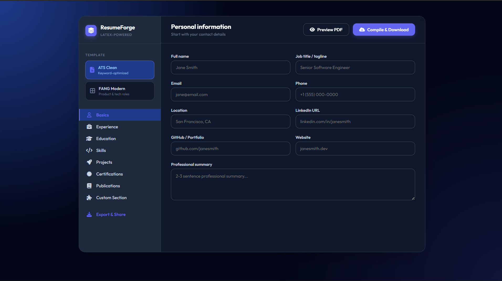
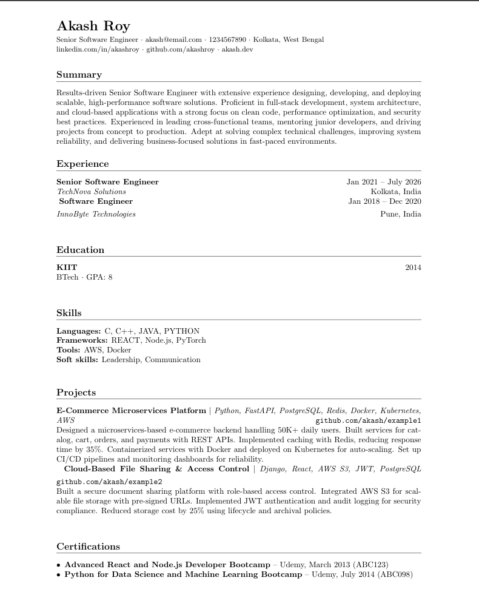

# ResumeForge

ResumeForge is a completely client-side LaTeX resume builder. It gives you the perfect typographic quality of a LaTeX resume without making you write a single line of LaTeX code or fight with formatting issues. 

It runs entirely in the browser. No backend, no build step, no npm install. Just open the HTML file and start typing.

---

## Screenshots

*(Add screenshots of the UI and generated resumes here)*




---

## Templates

There are two templates to choose from:

**ATS Clean** — This one is intentionally boring. Plain black and white, single column, no colors or fancy formatting. The whole point is to make sure it gets parsed correctly by Applicant Tracking Systems, which a lot of companies use to filter resumes before a human even sees them.

**FANG Modern** — This one is for when you want your resume to actually look nice. It uses a blue accent color, a two-column skills layout, and small icons next to your contact links (like a GitHub icon next to your GitHub URL). Better suited for tech roles where the recruiter is actually reading it.

---

## How to use it

1. Download or clone the repo.
2. Open `index.html` in Chrome, Firefox, or any modern browser.
3. Fill in your details. There are sections for experience, education, skills, projects, certifications, publications, and a custom section if you need anything extra.
4. Pick your template from the sidebar.
5. Hit **Compile & Download**. The app will generate the LaTeX code, send it to a free public compiler API, and download your finished PDF.

*Note: You need an internet connection for the PDF compilation to work since it uses an external API (`latex.ytotech.com`). Everything else works offline.*

---

## Stack

- HTML, CSS, vanilla JavaScript — no frameworks
- Google Fonts (Outfit) + FontAwesome 6 for the UI
- `latex.ytotech.com` for the backend PDF compilation

---

## Files

```text
resumeforge/
├── index.html   — app layout and structure
├── style.css    — all the styling
└── app.js       — form logic and LaTeX generation
```

## 👨‍💻 Author
**Anubhab Das**  
Feel free to reach out if you have any questions, feedback on the LaTeX generation, or suggestions for the UI!

## 💡 Feedback & Support
If something doesn't work right or you have an idea for a new feature — maybe a third template, a new section type, or anything else — just open an issue. I check them and genuinely appreciate the feedback.